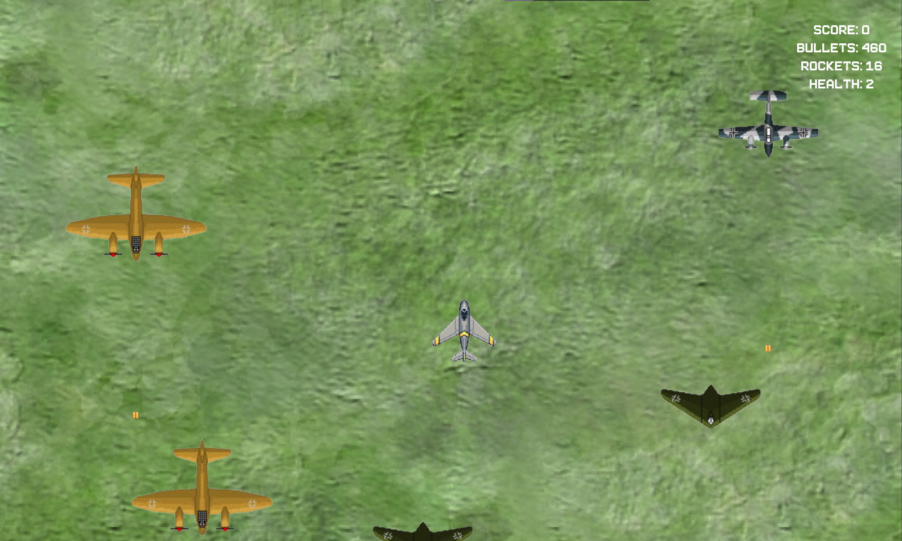

# Sky-Bandits-2
## The sequel of my previous game about planes, now with older planes and better mechanics.
- Game was made using pygame and pygame-menu

### Starting up:
- make sure you have the latest version 
- copy all files into one folder/project
- run main.py
- use settings.py to change menu window params
- get this repository starred, help the author;)

### Troubles playing?
- check k_spawn variable of different objects in games/game1 and games/game2, configure them as you want.
- check enemy_map in game_objects, configure speed and health of enemies.

### Screenshots:

