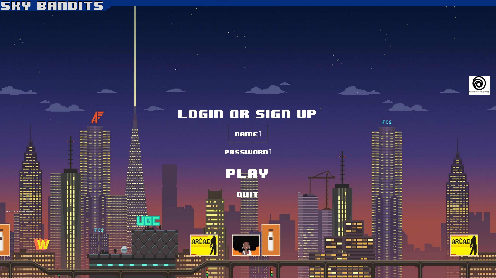
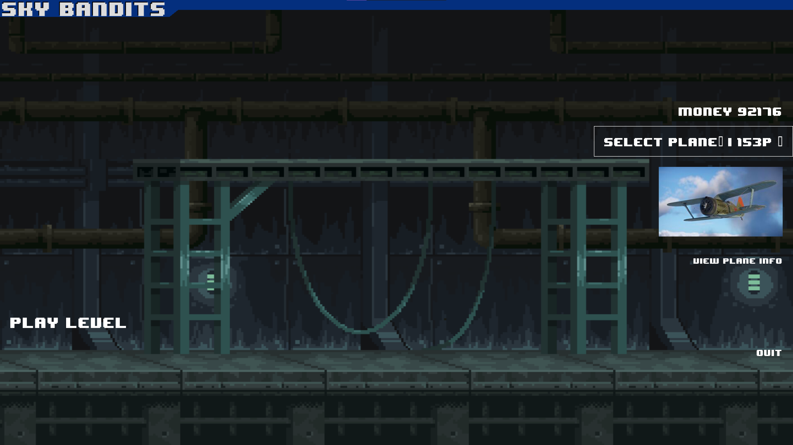
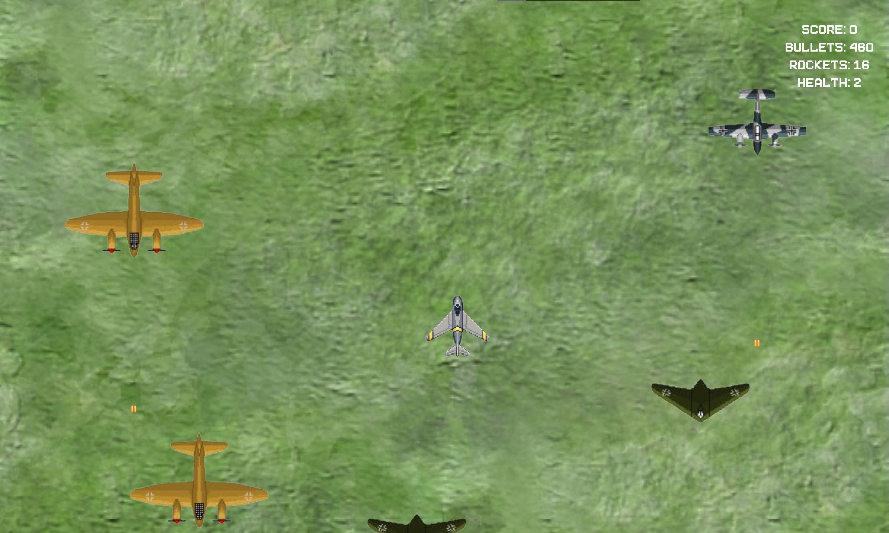
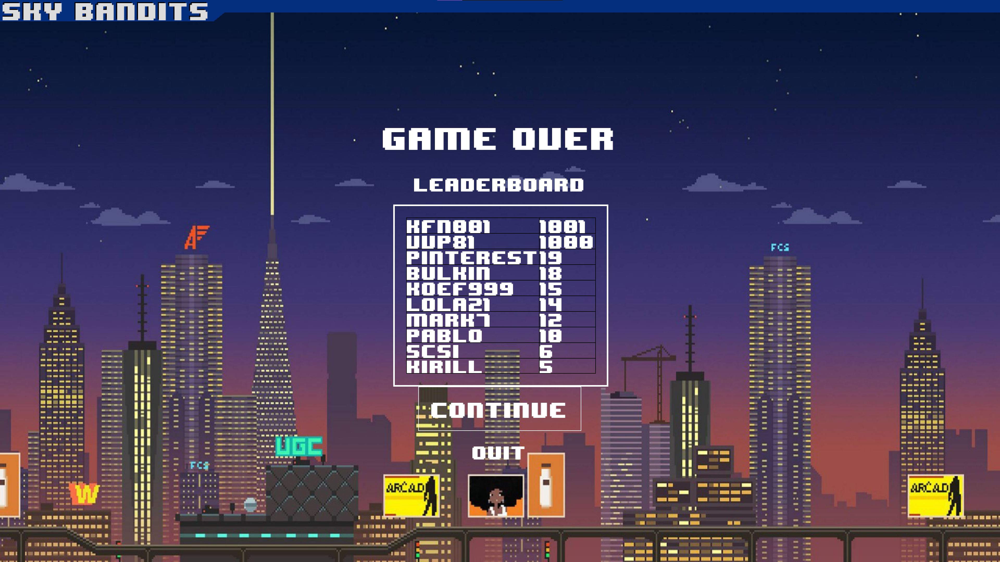

# Sky-Bandits-2

## Вторая часть игры про авиацию

- Игра была написана на python с помощью библиотек pygame и pygame-menu
- Основная идея/ТЗ - приятная аркадная игра, чтобы каратать время.
- Хорошее меню, нормальная музыка, звук, анимации и интересные механики по типу возврата боеприпасов при попадании во врага
- Управление: WASD или стрелочки, стрельба - ЛКМ, секрет - ПКМ (только game2)
- Наличие справочной информации (ссылки)
- Несколько боевых машин, лидерборд, прокачка
- БД с игроками и ЛТХ самолетов
- +- Историчность, правдаподобность некоторых параметров ЛТХ
- Хардкорность

### Запуск:
- Убедитесь, что у вас последняя версия
- Сохраните все файлы в одну папку/проект
- Запустите main.py
- Используйте settings.py для изменения параметров окна меню

### Проблемы с игрой?
- Проверьте k_spawn переменную разных объектов в games/game1 и games/game2, исправьте их, если надо.
- Проверьте enemy_map в game_objects, конфигурируйте скорость и здоровье врагов.

### Screenshots:

